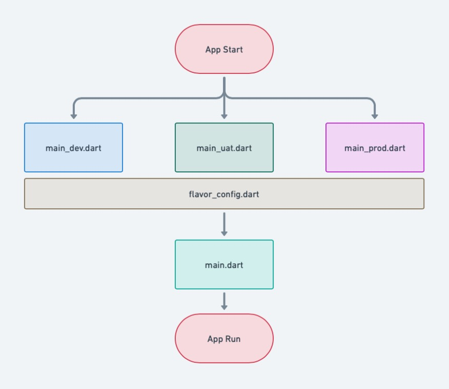

# Dokumentasi Mobile Survey App

Mobile Survey App ini menggunakan Flutter sebagai framework. Dengan menggunakan flutter, aplikasi ini dapat diexport sebagai Android app ataupun iOS app.

## Folder Structure

Folder structure pada Mobile Survey App adalah sebagai berikut :
```
├── assets
│   ├── icon
├── build
│   ├── app
├── lib
│   ├── components
│   ├── feature
│   ├── utility
│   ├── flavor_config.dart
│   ├── main_dev.dart
│   ├── main_prod.dart
│   ├── main_uat.dart
│   ├── main.dart
│   ├── router.dart
├── pubspec.yaml
```
### 1. Assets
Folder ini berisi asset yang digunakanan oleh aplikasi. Bisa berupa font, icon, atau image. Asset yang disimpan kedalam folder ini nantinya harus didefine pada file bernama [pubspec.yaml](/pubspec.yaml)

### 2. Build
Jika kita mempublish aplikasi kedalam bentuk .apk ataupun .ipa nantinya akan digenerate kedalam folder ini

### 3. Lib
Folder lib adalah folder tempat kita bekerja. Semua coding yang kita lakukan ada didalam folder lib ini. Ada file inti yang tidak boleh diubah didalam lib, yaitu main.dart. File ini adalah inti dari aplikasi yang dibuat, dia berisi main() funtion yang berfungsi untuk menjalankan aplikasi. Pada aplikasi Mobile Survey, isi main.dart kurang lebih sebagai berikut.

```dart
  final FirebaseNotificationService _firebaseNotificationService =
      FirebaseNotificationService();

  @override
  void initState() {
    handleStartUpNotification(); //Inisialisasi Firebase Notif

    super.initState();
  }

  Future<dynamic> handleStartUpNotification() async {
    await _firebaseNotificationService.initialize();
  }

  @override
  Widget build(BuildContext context) {
    return MultiProvider(
      providers: [
        ChangeNotifierProvider(create: (_) => Provider()),
      ],
      child: MaterialApp(
        title: 'Title',
        theme: ThemeData(
            primaryColor: primaryColor,
            textTheme: GoogleFonts.nunitoSansTextTheme()),
        onGenerateRoute: Routers.generateRoute, //Generate Routing App
        initialRoute: StringRouterUtil.splashScreenRoute, //Initial Route
      ),
    );
  }
```
Pada aplikasi Mobile Survey menggunakan terdapat tiga folder, yaitu :
* ***Components*** : Isi dari folder ini adalah untuk styling dan component yang sering digunakanan oleh aplikasi.
* ***Feature*** : Folder ini berisi semua feature yang ada pada aplikasi. Sebagai contoh feature [Login](/lib/feature/login/), didalam feature login terdapat folder beranama **Bloc** (state management yang berfungsi sebegai business logic dan sebagai cara untuk mengambil data dari api), **Dao** (karena aplikasi bisa digunakan secara offline, maka dibuatlah database local. Dao ini berisi query yang digunakan kedalam database local), **Data** (berisi model data, bisa untuk model api atau untuk mengirim data ke class lain), **Domain** (terdapat 2 file yaitu api dan repo. **api** class ini digunakan untuk menanggil api, kita bisa membuat configurasi kondisi untuk response dari api. **repo** class untuk mengatur mendapatkan data dari screen ke api class.), **Provider** (ini berfungsi sebagai pertukaran data antar widget dalam 1 class. Karena ada beberapa widget yang dipisah dalam 1 screen, maka digunakan provider untuk komunikasi data antar widget.) **Screen** (terdapat file dari Feature tersebut, main file dari feature tersebut), **Widget** (ini berisi component yang ada didalam screen)
```

├── login
│   ├── bloc
│   ├── dao
│   ├── data
│   ├── domain
│   │  ├── api
│   │  ├── repo
│   ├── provider
│   ├── screen
│   ├── widget
```
* ***Utility*** : Folder ini berisi segalam macam utility yang dipakai pada aplikasi mobile survey yang dapat direuse oleh masing - masing feature.

## Main Code

Agar dapat mempermudah config ditiap environment, dibuatlah flavoring untuk tiap-tiap environment (dev,uat,prod). Configurasi ini terdapat pada file [flavor_config](lib/flavor_config.dart) [main_dev](lib/main_dev.dart) / [main_uat](lib/main_uat.dart) / [main_prod](lib/main_prod.dart)


```dart
class FlavorValues {
  FlavorValues({@required this.baseUrl, @required this.userId});
  final String? baseUrl; //example parameter
  final String? userId; //example parameter
}

class FlavorConfig {
  factory FlavorConfig(
      {@required Flavor? flavor, @required FlavorValues? values}) {
    _instance ??= FlavorConfig._internal(
        flavor!, StringUtil.enumName(flavor.toString()), values!);
    return _instance!;
  }
  const FlavorConfig._internal(this.flavor, this.name, this.values);
  static FlavorConfig get instance {
    return _instance!;
  }

  final Flavor flavor;
  final String name;
  final FlavorValues values;
  static FlavorConfig? _instance;

  static bool isProduction() => _instance!.flavor == Flavor.PRODUCTION;
  static bool isUat() => _instance!.flavor == Flavor.UAT;
  static bool isDevelopment() => _instance!.flavor == Flavor.DEV;
}
```
Pada flavor_config.dart, kita bisa setting parameter apa yang diperlukan untuk inisialisasi pada tiap-tiap envinronment. Sebegai contoh parameter yang diperlukan adalah baseurl dan userid. Karena setiap environment memiliki baseurl dan userid berbeda, jadi kita setting diawal sehingga memudahkan developer dalam membedakan tiap-tiap environment.

```dart
//main_dev.dart
Future main() async {

  FlavorConfig(
      flavor: Flavor.DEV,
      values: FlavorValues(
          baseUrl: 'http://xxx.xxx.xxx.x/', userId: 'abcdefg'));
  runZonedGuarded(() {
    runApp(const MyApp());
  }, (Object error, StackTrace stack) {});
}
```
Configurasi pada flavor_config akan didimplement pada class main_dev diatas. Value baseUrl dan userId akan diisi sesuai dengan environment yang dibuat.

```dart
//router.dart
class Routers {
  static Route<dynamic> generateRoute(RouteSettings settings) {
    switch (settings.name) {
      case StringRouterUtil.splashScreenRoute: //without passing data
        return PageRouteBuilder<dynamic>(
            pageBuilder: (_, __, ___) => const SplashScreen(),
            settings: RouteSettings(name: settings.name),
            transitionsBuilder: (_, Animation<double> a, __, Widget c) =>
                FadeTransition(opacity: a, child: c));
     
      case StringRouterUtil.form2ScreenRoute: //with passing data model
        final TaskList taskList = settings.arguments as TaskList;
        return PageRouteBuilder<dynamic>(
            pageBuilder: (_, __, ___) => FormSurvey2Screen(taskList: taskList),
            settings: RouteSettings(name: settings.name),
            transitionsBuilder: (_, Animation<double> a, __, Widget c) =>
                FadeTransition(opacity: a, child: c));

      case StringRouterUtil.previewImageAssetScreenRoute: //with passing data
        final String imagePath = settings.arguments as String;
        return PageRouteBuilder<dynamic>(
            pageBuilder: (_, __, ___) =>
                PreviewImageAssetScreen(imagePath: imagePath),
            settings: RouteSettings(name: settings.name),
            transitionsBuilder: (_, Animation<double> a, __, Widget c) =>
                FadeTransition(opacity: a, child: c));

      default:
        return MaterialPageRoute<dynamic>(
            builder: (_) => Scaffold(
                  body: Center(
                      child: Text('No route defined for ${settings.name}')),
                ));
    }
  }
}
```
Metode routing pada aplikasi Mobile Survey menggunakan nama dari class yang dituju. Kita perlu membuat file router yang isinya adalah Navigation methode dari setiap class yang dituju. Pada contoh diatas terdapat 3 model cara Navigation, tanpa passing data, dengan passing data model, dengan passing data. Setelah itu, file router ini perlu dipanggil pada [main.dart](lib/main.dart).

```dart
 Navigator.pushNamed(
              context, StringRouterUtil.loginScreenRoute);
```
Contoh diatas untuk navigation tanpa passing data

```dart
 Navigator.pushNamed(context, StringRouterUtil.form2ScreenRoute,
              arguments: TaskList taskList);
```
Contoh ini untuk navigation with passing data model. Perbedaanya adalah tambahan arguments pada akhir function.

```dart
 Navigator.pushNamed(context, StringRouterUtil.form2ScreenRoute,
              arguments: String code);
```
Contoh ini untuk navigation with passing data. Sama seperti yang diatas, cuma perbedaanya adalah data yang dipassing String.

```yaml
name: mobile_survey
description: A new Flutter project.

publish_to: "none"

version: 1.0.0+10 # App Version

environment:
  sdk: ">=2.17.0 <3.0.0" # SDK Version

dependencies:
  flutter:
    sdk: flutter
  # add package library
  cupertino_icons: ^1.0.2 #material app
  google_fonts: ^3.0.1 #to get google font
  http_proxy: ^1.2.1 #for proxy api
  provider: ^6.0.4 #for state management
  image_picker: ^0.8.4+1 #to get image from camera and gallery
  camera: ^0.9.2+2 #to take picture from camera
  dropdown_button2: ^1.9.2 #custom drop down
  group_radio_button: ^1.3.0 #custom radio button
  http: ^0.13.5 #for call api
  equatable: ^2.0.5
  flutter_bloc: ^8.1.1 #state management
  floor: ^1.4.2 #database local
  sqflite: ^2.0.2 #database local
  shared_preferences: ^2.0.15 #saving key-value
  shimmer: ^2.0.0 #loading skeleton
  device_info_plus: ^8.2.2 #to get device informasion such as device id
  get_ip_address: ^0.0.5 #tp get ip
  intl: ^0.18.0 #for deal with date and number formatting and parsing issues.
  internet_connection_checker: ^0.0.1+3 #to check network device
  path: ^1.7.0 #for change file name image
  open_file: ^3.2.1 #for open file pdf
  path_provider: ^2.0.4 #for open file pdf
  pdf: ^3.8.4 #for open file pdf
  flutter_map: ^2.2.0 #for show map from lat long
  latlong2: ^0.8.2 #convert lat long
  geocoding: ^2.0.5 #get location
  url_launcher: ^6.1.10 #to run url such as action text whatsapp or call
  firebase_core: ^2.3.0 #config firebase project
  firebase_messaging: ^14.1.2  #for firebase notification
  flutter_local_notifications: ^13.0.0 #for local notification
  notification_permissions: ^0.6.1  #for permission notification

dev_dependencies:
  flutter_test:
    sdk: flutter
  floor_generator: ^1.4.2
  build_runner: ^2.1.2
  flutter_lints: ^2.0.0
  change_app_package_name: ^1.0.0

flutter:

  uses-material-design: true

  # To add assets to your application, add an assets section, like this:
  assets:
    - assets/
    - assets/icon/
  
  fonts:
    - family: Schyler
      fonts:
        - asset: fonts/Schyler-Regular.ttf
        - asset: fonts/Schyler-Italic.ttf
          style: italic
```
File pubspec.yaml adalah konfigurasi utama pada flutter app. Jika kita ingin menambahkan package library dan asset (image, font), kita perlu menambahkan di file ini. Selain itu, configurasi sdk version pada flutter dan version untuk aplikasi flutter juga harus diconfig dari file ini.

## Utility Code

Folder ini berisi segalam macam utility yang dipakai pada aplikasi mobile survey yang dapat direuse oleh masing - masing feature. Berikut isinya :

### 1. [database_util](lib/utility/database_util.dart)

Class ini berfungsi sebagai configurasi database. Semua Dao yang sudah dibuat, dan table yang dibuat akan dimasukkan kedalam database_util.dart. 
```dart
@Database(version: 1, entities: [
  User,
])
abstract class AppDatabase extends FloorDatabase {
  UserDao get userDao;
}
```
Setiap kali kita menambahkan table baru dan Dao baru kedalam sini, kita perlu menaikan version database dan generate ulang database tersebut dengan menggunakan command ini.
```
flutter packages pub run build_runner build
```

### 2. [firebase_notification_util](lib/utility/firebase_notification_service.dart)
Class ini dibuat untuk menconfig firebase notification yang nanti akan dikirim melalui backend. Didalam sini terdapat permission, subscribe, unsubscribe, icon, serta action jika user mengklik notification yang diterima.

### 3. [network_util](lib/utility/network_util.dart)
Class ini berfungsi sebagai pengecekan connection pada aplikasi, karena aplikasi ini bisa digunakan secara offline maka perlu ada pengecekan connection. Cara menggunakannya adalah sebagai berikut :

```dart
NetworkInfo(internetConnectionChecker).isConnected.then((value) {
    if (value) {
        setState(() {
          isConnect = true;
        });
        getAddress();
    } else {
        setState(() {
          isConnect = false;
        });
    }
});
```
Class ini dipanggil setiap kita mau melakukan pengecekan network.
### 4. [shared_pref_util](lib/utility/shared_pref_util.dart)
Sharedpreferences digunakan untuk menyimpan data key-value, digunakan untuk menyimpan token dan username pada aplikasi mobile surver. Begini cara menggunakannya :

```dart
// Simpan Data
SharedPrefUtil.saveSharedString('token', token);

// Gunakan Data
final String? token = await SharedPrefUtil.getSharedString('token');

// Hapus Data
SharedPrefUtil.deleteSharedPref('token').then((value) {});
```

### 5. [url_util](lib/utility/url_util.dart)
Class ini dipakai untuk menyimpan header, dan url untuk pemanggilan api. Berikut contohnya :

```dart
static Map<String, String> headerTypeWithToken(String token, String ip) => {
        'Authorization': 'Bearer $token',
        'Content-Type': 'application/json',
        'Accept': 'application/json',
        'Ipaddress': ip,
        'Userid': userId
};

Map<String, String> getHeaderTypeWithToken(String token, String ip) {
    return headerTypeWithToken(token, ip);
}

static String urlTaskList() => '/TaskMain/Getrows';

String getUrlTaskList() {
    final String getUrlTaskList2 = urlTaskList();
    return baseUrl + getUrlTaskList2;
}
```

Dan ini cara menggunakannya :
```dart
final Map<String, String> header =
        urlUtil.getHeaderTypeWithToken(token!, ip['ip']!);

final res = await http.get(Uri.parse(urlUtil.getUrlTaskList()),headers: header);
```